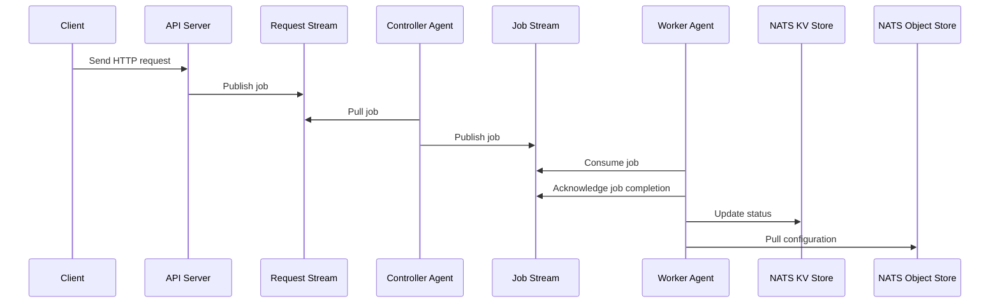

# Grid of Remote Infrastructure Daemons

**GRID** (**Grid of Remote Infrastructure Daemons**) is a NATS-based job execution system designed for the seamless orchestration and management of jobs across a cluster of machines. By leveraging host agents and utilizing NATS as a message bus, GRID ensures efficient communication, robust scalability, and reliable job execution suitable for various distributed systems.

## Features

- **Scalable Job Execution:** Efficiently manage and execute jobs across numerous nodes.
- **NATS Integration:** Leverages NATS for reliable message passing and job distribution.
- **Distributed Locking:** Ensures serialized job execution where necessary.
- **Status Tracking:** Monitor the status of workers and jobs in real-time.
- **Flexible Targeting:** Similar to Ansible, target all nodes, specific groups, or individual nodes.
- **Fault Tolerance:** Automatically handles failures and retries to ensure job completion.
- **Extensible Architecture:** Easily extendable to accommodate custom job types and workflows.
- **Configuration Management:** Use NATS Object Store for dynamic configuration updates.

## Architecture

GRID comprises three primary components: the **API Server**, **Controller Agents**, and **Worker Agents**. Each plays a distinct role in the job execution workflow, ensuring jobs are handled efficiently from initiation to completion.

### Components

#### API Server

- **Function:** Acts as the entry point for client requests.
- **Operation:**
  - Listens for incoming HTTP requests from clients.
  - Upon receiving a request, it **publishes** the job onto the **Request Stream** using a WorkQueue policy via NATS.
  - Provides endpoints for monitoring job and worker statuses.
  - Manages configuration files/templates in the NATS Object Store.

#### Controller Agents

- **Function:** Manage job distribution from the Request Stream to the Job Stream.
- **Operation:**
  - Run on designated Controller machines.
  - Pull jobs from the Request Stream.
  - Attempt to publish jobs to the Job Stream.
    - If the Job Stream is busy, send a negative acknowledgement (**Nak**) with a delay.
    - The Request Stream will attempt redelivery of the message with infinite retries.
  - If a job is successfully published to the Job Stream, the Controller acknowledges (**Ack**) the Request.

#### Worker Agents

- **Function:** Execute jobs assigned to them.
- **Operation:**
  - Run on all machines within the cluster.
  - Consume jobs from the Job Stream.
  - Execute the assigned jobs.
  - Acknowledge job completion, signaling to Controllers that the Job Stream is available for new jobs.
  - Update their status in the NATS KV Store for monitoring purposes.
  - Pull configuration files/templates from the NATS Object Store as needed.

### Workflow


## Stream Configuration

Proper stream configuration is crucial for ensuring efficient task distribution and execution. Below are the configurations for the Request and Job Streams, along with Worker Consumers and Controller Agents behavior.

### Request Stream

- **Policy:** WorkQueue
  - Ensures tasks are evenly distributed among Controller Agents.

### Job Stream

- **Message Limit:** 1
  - Only one task is active in the Job Stream at any given time.
- **Overflow Policy:** DeleteNew
  - New messages are discarded if the stream reaches its limit.
- **Delivery Policy:** Interest
  - Tasks are delivered to interested Worker Agents based on subject filters.

### Worker Consumers

- **Type:** Ephemeral Pull Consumers
  - Workers create transient pull consumers with specific subject filters.
- **Subject Filters:**
  - Configured based on worker groups.
  - Includes default subjects like `tasks.all.>` and `tasks.{workerID}.>`.
- **Task Execution:**
  - Upon receiving a task message, each interested Worker Agent executes the task.
  - After execution, the Worker Agent acknowledges completion.
  - The Interest policy removes the task from the stream once all interested consumers have acknowledged it.

### Controller Agents Stream Handling

- **Task Publishing:**
  - Controllers attempt to publish tasks from the Request Stream to the Job Stream.
  - If the Job Stream is busy, Controllers send a **Nak** with a delay.
  - The Request Stream will then attempt redelivery of the task with infinite retries.
  - Once the Job Stream is available, Controllers successfully publish the task and **Ack** the Request.

## NATS KV Store

GRID utilizes a Key-Value (KV) store to manage state and coordination between components.

### Status Tracking

- **Purpose:** Monitor and track the status of both Workers and Tasks.
- **Operation:**
  - Workers update their status upon task assignment and completion.
  - Clients can query the API Server to retrieve real-time status information via HTTP.
  - Provides visibility into system health and task progress.

### Distributed Locking

- **Purpose:** Ensure serialized execution of tasks that must run one at a time.
- **Operation:**
  - Implements atomic locks with Time-To-Live (TTL) settings.
  - When a task specifies serialized execution, Workers compete to acquire a lock before executing the task.
  - The Worker that acquires the lock performs the task, releases the lock upon completion, allowing the next Worker to proceed.
  - Prevents race conditions and ensures task consistency.

## NATS Object Store

GRID utilizes the NATS Object Store for managing configuration files and templates.

### Configuration Management

- **Purpose:** Manage and distribute configuration files and templates dynamically.
- **Operation:**
  - API Server manages configuration files/templates in the NATS Object Store.
  - Worker Agents pull configuration files/templates from the NATS Object Store as needed.
  - Ensures that all Worker Agents have the latest configuration files/templates.

## Functionality

GRID's architecture enables it to function similarly to orchestration tools like Ansible. It allows:

- **Targeted Task Execution:**
  - Execute tasks across all nodes, specific groups, or individual nodes based on subject interests.
- **Parallel Processing:**
  - Distribute tasks efficiently among multiple Workers, ensuring scalability.
- **Synchronized Task Completion:**
  - Wait for all relevant Workers to complete their tasks before moving on to subsequent tasks, ensuring consistency and reliability.
- **Real-Time Monitoring:**
  - Track task and worker statuses in real-time through the API Server's endpoints.
- **Fault Tolerance:**
  - Automatically handle task retries and manage failures gracefully to maintain system stability.

## Examples

Here are some example scenarios to help you get started with GRID.

### Example 1: Executing a Backup Job Across All Nodes

```bash
curl -X POST http://localhost:8080/tasks \
     -H "Content-Type: application/json" \
     -d '{
           "task": "backup",
           "targets": ["all"]
         }'
```

**Response:**
```json
{
  "task_id": "12345",
  "status": "queued",
  "message": "Backup task has been queued for execution."
}
```

### Example 2: Checking Job Status

```bash
curl http://localhost:8080/tasks/12345/status
```

**Response:**
```json
{
  "task_id": "12345",
  "status": "in_progress",
  "workers": {
    "worker1": "completed",
    "worker2": "in_progress",
    "worker3": "pending"
  }
}
```

## License

This project is licensed under the [Apache 2.0 License](LICENSE).
