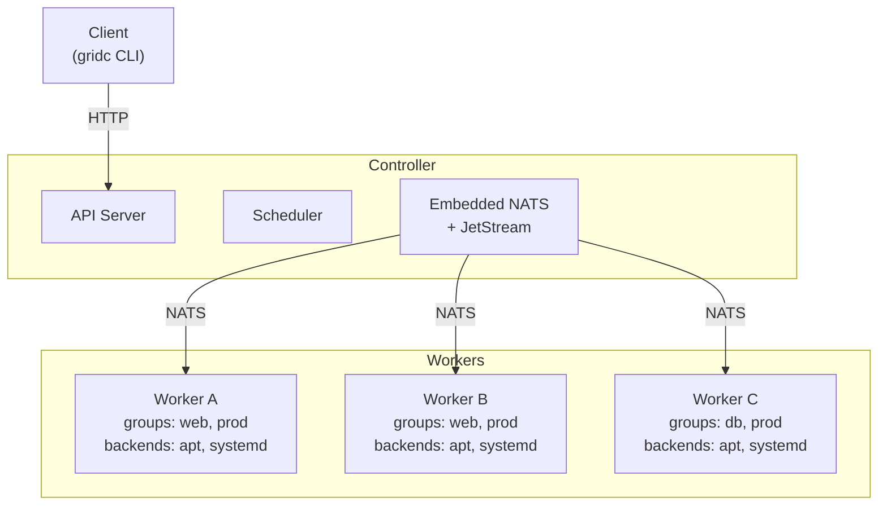
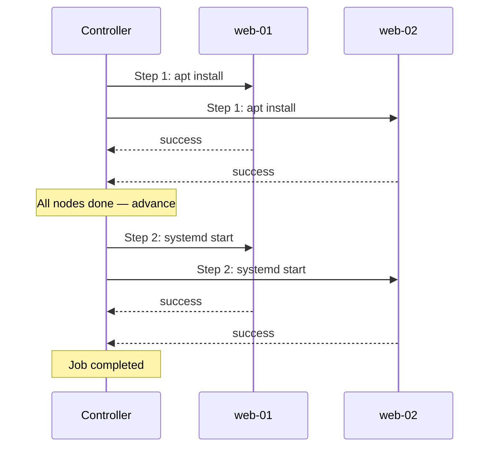
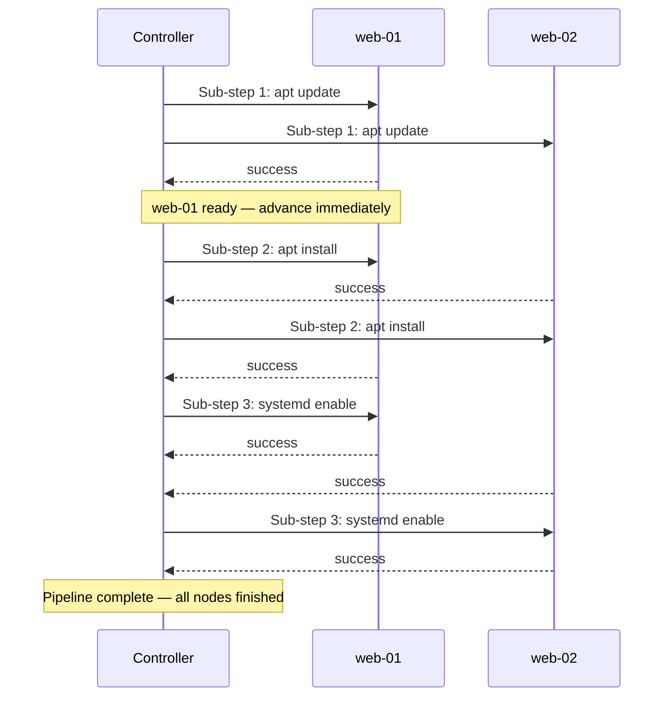

# GRID

**GRID** (Grid Remote Infrastructure Director) is a distributed orchestration engine for executing tasks across fleets of nodes. A controller dispatches multi-step jobs to workers over [NATS JetStream](https://docs.nats.io/nats-concepts/jetstream); workers execute backend actions and report results.

## Features

- **Multi-step job execution** with barrier synchronization between steps
- **Hierarchical execution model** — YAML nesting defines barrier vs. pipeline semantics
- **Per-node pipelines** — nodes advance through sub-steps independently, no cross-node sync
- **Flexible targeting** — run tasks on all nodes, a group, or a specific node
- **Failure strategies** — fail-fast (stop on first failure) or continue (exclude failed nodes)
- **Conditional execution** — `on_success`, `on_failure`, and `always` conditions for rollback/cleanup
- **Per-task retries** with exponential backoff
- **Per-task and per-job timeouts**
- **Job cancellation** via API
- **Job queuing** with configurable concurrency and pending limits
- **Extensible backend system** — `apt`, `systemd`, `rke2`, `ping`, and `test` backends included
- **Embedded NATS** — the controller runs an in-process NATS server; no external dependencies

## Architecture



The CLI client (`gridc`) is HTTP-only — it talks to the controller's REST API. Workers connect to the controller's embedded NATS server.

## Execution Models

YAML structure defines the execution mode. **Barrier** (flat list) synchronizes all nodes between steps. **Pipeline** (nested `tasks` block) lets each node advance independently.

#### Barrier (default)

All nodes must complete each step before the next one begins:



#### Pipeline

Each node advances through sub-steps on its own — no cross-node waiting:



Pipeline phases can be followed by a barrier step to re-synchronize all nodes (e.g., `systemd start` only after every node has finished installing).

## Quick Start

```bash
# Build (requires Go 1.23+ and task)
task

# Run with Docker Compose (1 controller, 2 workers)
docker compose up --build

# Run scenario tests
task scenario -- scenarios/jobs/smoke-test.yaml
```

Binaries are output to `bin/`: `grid` (controller), `gridw` (worker), `gridc` (CLI).

## Job Specification

Jobs are YAML files describing a target and a list of phases (tasks). There are two execution modes defined by YAML nesting:

### Flat Jobs (Barrier Synchronization)

Each step completes on **all** targeted nodes before the next step begins. This is the default behavior and is backward compatible with the original format.

```yaml
target:
  scope: group
  value: web
tasks:
  - backend: apt
    action: update
  - backend: apt
    action: install
    params: { package: nginx }
  - backend: systemd
    action: start
    params: { unit: nginx }
```

### Hierarchical Jobs (Pipeline Phases)

Nesting a `tasks` block creates a **pipeline phase** — each node advances through the sub-steps independently without waiting for other nodes. Top-level items remain barrier-synchronized.

```yaml
target:
  scope: group
  value: web
tasks:
  # Pipeline phase: each node runs these independently
  - tasks:
      - backend: apt
        action: update
      - backend: apt
        action: install
        params: { package: nginx }
      - backend: systemd
        action: enable
        params: { unit: nginx }
  # Barrier phase: all nodes sync before this runs
  - backend: systemd
    action: start
    params: { unit: nginx }
```

In this example, Phase 0 (pipeline) lets each web server run apt update, apt install, and systemd enable at its own pace. Only after **all** nodes complete the pipeline does Phase 1 (barrier) dispatch systemd start to everyone.

### Conditions and Failure Handling

```yaml
target:
  scope: all
strategy: fail-fast
tasks:
  - backend: apt
    action: install
    params: { package: myapp }
  - backend: systemd
    action: start
    params: { unit: myapp }
  - condition: on_failure
    tasks:
      - backend: apt
        action: remove
        params: { package: myapp }
      - backend: ping
        action: echo
        params: { message: "rollback complete" }
```

Conditions: `always` (default), `on_success` (skip if any prior step failed), `on_failure` (run only if a prior step failed). Conditions work on both leaf tasks and pipeline phases.

### Task Options

| Field | Description |
|-------|-------------|
| `backend` | Backend name (e.g., `apt`, `systemd`, `ping`, `test`) |
| `action` | Action to execute (backend-specific) |
| `params` | Key-value parameters |
| `timeout` | Per-task timeout (e.g., `"30s"`, `"5m"`) |
| `max_retries` | Retry attempts on failure with exponential backoff |
| `condition` | `always`, `on_success`, or `on_failure` |

## CLI Usage

```bash
# Single-task shorthand
gridc job run -t all ping echo message=hello
gridc job run -t group:web apt install package=nginx

# Submit a job from a YAML file
gridc job run -f deploy.yaml

# Submit and wait for completion
gridc job run -f deploy.yaml --wait

# Check job status
gridc job get <job-id>

# List all jobs
gridc job list

# Cancel a running job
gridc job cancel <job-id>

# List registered nodes
gridc node list

# Show node details
gridc node info <node-id>

# Cluster status
gridc status
```

Set the controller address with `-a` or `GRID_API` environment variable (default: `http://localhost:8765`).

## API

| Method | Endpoint | Description |
|--------|----------|-------------|
| `POST` | `/job` | Submit a new job |
| `GET` | `/job/:id` | Get job status and results |
| `POST` | `/job/:id/cancel` | Cancel a running or pending job |
| `GET` | `/jobs` | List all jobs |
| `GET` | `/nodes` | List registered nodes |
| `GET` | `/node/:id` | Get node details |
| `GET` | `/status` | Cluster status |

### Example: Submit a job

```bash
curl -X POST http://localhost:8765/job \
  -H "Content-Type: application/json" \
  -d '{
    "target": {"scope": "group", "value": "web"},
    "strategy": "fail-fast",
    "tasks": [
      {"backend": "apt", "action": "install", "params": {"package": "nginx"}},
      {"backend": "systemd", "action": "start", "params": {"unit": "nginx"}}
    ]
  }'
```

### Example: Job response

```json
{
  "id": "a1b2c3d4e5f6",
  "target": {"scope": "group", "value": "web"},
  "status": "completed",
  "step": 1,
  "expected": ["web-01", "web-02"],
  "results": {
    "0": {
      "web-01": {"status": "success", "output": "ok", "duration": "2.3s"},
      "web-02": {"status": "success", "output": "ok", "duration": "1.8s"}
    },
    "1": {
      "web-01": {"status": "success", "duration": "0.4s"},
      "web-02": {"status": "success", "duration": "0.5s"}
    }
  }
}
```

## Configuration

### Controller (`controller.yaml`)

```yaml
api:
  host: 0.0.0.0
  port: 8765
nats:
  name: controller
  server:
    host: 0.0.0.0
    port: 4222
  jetstream:
    store_dir: /data/jetstream
scheduler:
  max_concurrent: 5
  max_pending: 100
```

### Worker (`worker.yaml`)

```yaml
nats:
  name: web-01
  client:
    urls: nats://controller:4222
worker:
  groups:
    - web
    - prod
```

## Backends

| Backend | Actions | Description |
|---------|---------|-------------|
| `apt` | `update`, `install`, `remove`, `upgrade` | Debian package management |
| `systemd` | `start`, `stop`, `restart`, `enable`, `disable`, `status` | Systemd unit management |
| `rke2` | `start`, `stop`, `status` | RKE2 Kubernetes management |
| `ping` | `echo`, `hostname`, `sleep` | Connectivity testing (pure Go) |
| `test` | `succeed`, `fail`, `sleep`, `output`, `flaky` | Deterministic test backend |

Backends implement the `Backend` interface and register via `init()`:

```go
type Backend interface {
    Run(ctx context.Context, action string, params map[string]string) (*Result, error)
    Actions() []string
}
```

## Testing

```bash
task test                    # all tests with race detector
go test ./... -v -race       # same, directly
go test ./internal/scheduler # single package
```

Tests use embedded NATS — no external services required. The test suite includes unit tests, scheduler orchestration tests (barrier and pipeline execution, failure strategies, conditions, retries, timeouts, cancellation), API endpoint tests, and full end-to-end integration tests with real workers.

## Project Structure

```
cmd/
  controller/     Controller entry point (embedded NATS + scheduler + API)
  worker/         Worker entry point
  client/         CLI client (gridc)
internal/
  api/            Echo HTTP API server
  client/         NATS client wrapper
  common/         Signal handling
  config/         YAML config loading
  controller/     Controller startup
  models/         Data types (Job, Phase, Task, Target, etc.)
  registry/       Node registry and target resolution
  scheduler/      Orchestration engine (barrier + pipeline execution)
  testutil/       Test helpers (embedded NATS, node fixtures)
  worker/         Worker agent (registration, heartbeat, task execution)
    backends/     Backend implementations
  integration/    End-to-end integration tests
scenarios/
  compose.yaml    Docker Compose topology
  configs/        Per-role config files
  jobs/           YAML job files for scenario testing
  run.sh          Scenario runner
docs/
  DESIGN.md       Architecture and design rationale
```

## License

This project is licensed under the [Apache 2.0 License](LICENSE).
