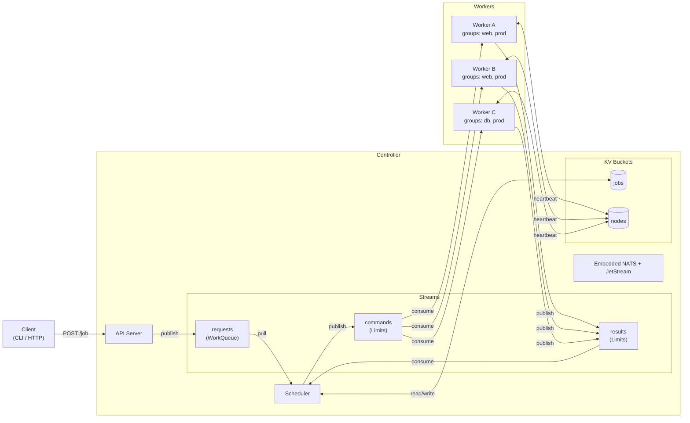
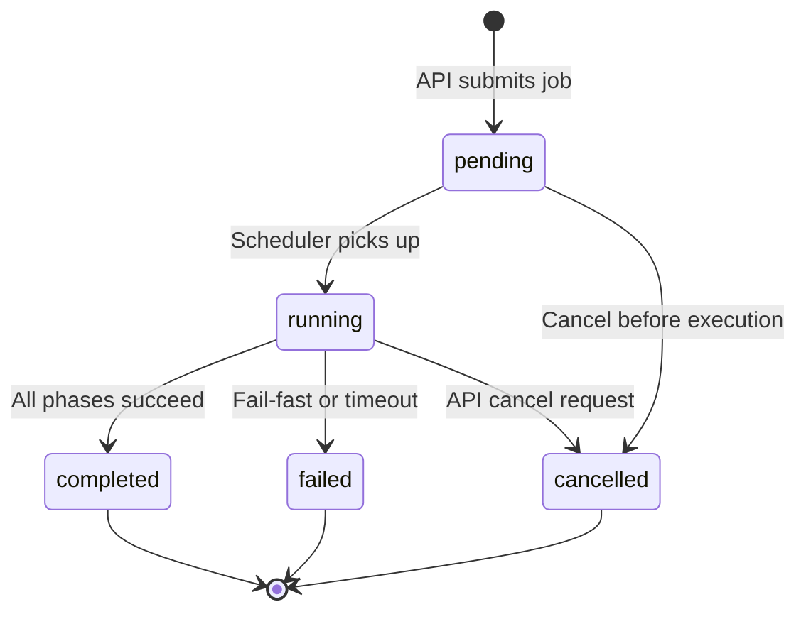
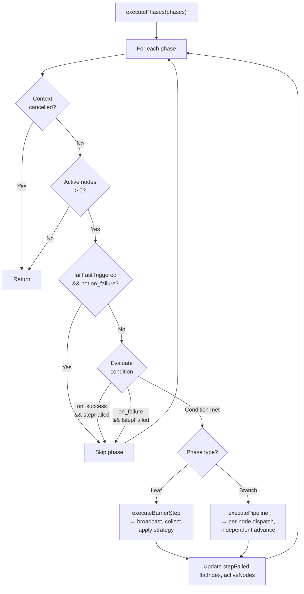
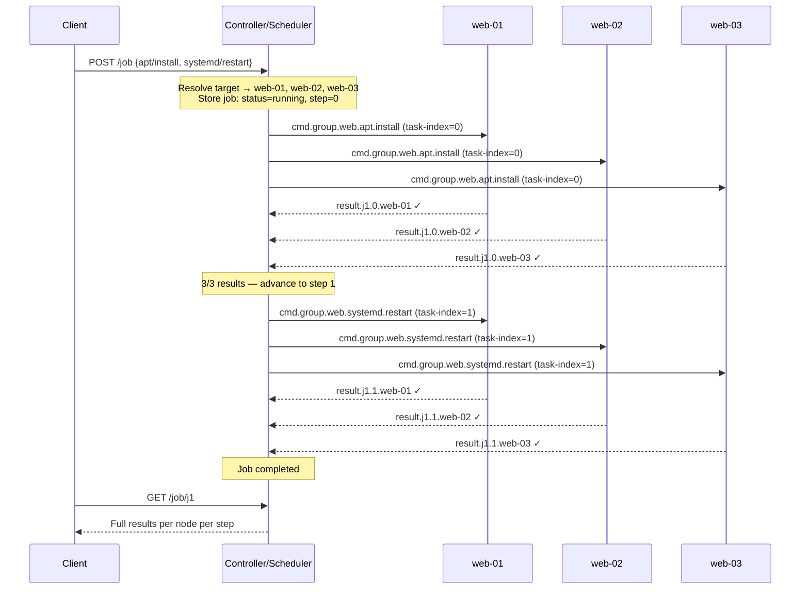
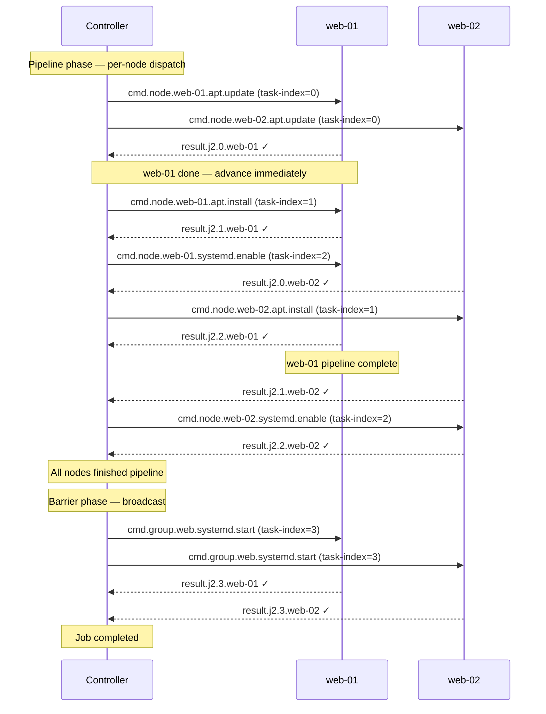

# GRID Redesign: Orchestration Engine

## Overview

This document describes the redesign of GRID's messaging topology and job model.
The existing chassis is kept: embedded NATS server, Go package structure, backend
plugin registry, CLI framework, Docker/Compose tooling. What changes is how jobs
are defined, routed to workers, executed across multiple nodes, and reported on.

## Design Principles

1. **Commands, not shells** -- Backends define a closed set of actions with structured
   parameters. No arbitrary command execution. The security model depends on this.
2. **Fan-out is the default** -- "Run this on all web servers" is the primary use case,
   not "run this somewhere." Work-queue semantics are a special case of targeting a
   single node.
3. **Results are first-class** -- Every execution produces a result that flows back
   to the controller. Job status is derived from aggregated results, not message acks.
4. **The controller is a scheduler** -- It doesn't just create infrastructure. It
   resolves targets, dispatches commands, tracks progress, and manages multi-step
   execution.
5. **Nodes are self-describing** -- Workers register themselves with their hostname,
   group memberships, and available backends. The controller uses this for target
   resolution and validation.

## Architecture



The three JetStream streams form the data backbone: `requests` (WorkQueue) for job submission,
`commands` (Limits) for controller-to-worker dispatch, and `results` (Limits) for worker-to-controller
reporting. Two KV buckets store durable state: `jobs` for job definitions/status and `nodes` for
worker registration/health.

## Data Model

### Task

A single unit of work executed by one backend. Used as the command dispatch type
(what gets sent over NATS to workers).

```go
type Task struct {
    Backend    string            `json:"backend"`
    Action     string            `json:"action"`
    Params     map[string]string `json:"params"`
    Timeout    string            `json:"timeout,omitempty"`
    MaxRetries int              `json:"max_retries,omitempty"`
    Condition  Condition         `json:"condition,omitempty"`
}
```

### Phase

A node in the hierarchical execution tree. Either a **leaf** (has backend/action,
represents a single task) or a **branch** (has a `tasks` sub-list, a pipeline of
sub-phases executed per-node).

```go
type Phase struct {
    // Leaf fields (single task)
    Backend    string            `json:"backend,omitempty"`
    Action     string            `json:"action,omitempty"`
    Params     map[string]string `json:"params,omitempty"`
    Timeout    string            `json:"timeout,omitempty"`
    MaxRetries int               `json:"max_retries,omitempty"`

    // Branch fields (pipeline of sub-phases)
    Tasks []Phase `json:"tasks,omitempty"`

    // Phase-level controls
    Condition Condition `json:"condition,omitempty"`
}
```

Helpers: `IsLeaf()`, `IsBranch()`, `ToTask()`, `LeafCount()`, `Validate(depth)`.
Maximum nesting depth is 2 (top-level = barrier, one level of nesting = pipeline).

Examples:
```json
{"backend": "apt",     "action": "install", "params": {"package": "curl"}}
{"backend": "systemd", "action": "restart", "params": {"unit": "nginx"}}
{"tasks": [{"backend": "apt", "action": "update"}, {"backend": "apt", "action": "install", "params": {"package": "nginx"}}]}
```

### Job

A sequence of phases with a target selector. Top-level phases are
barrier-synchronized (all nodes complete phase N before N+1 begins). Nested
phases within a pipeline branch execute per-node without cross-node sync.

```go
type Job struct {
    ID        string     `json:"id"`
    Target    Target     `json:"target"`
    Tasks     []Phase    `json:"tasks"`
    Strategy  Strategy   `json:"strategy"`           // "fail-fast" | "continue"
    Timeout   string     `json:"timeout,omitempty"`   // overall job timeout (e.g. "30m")
    Status    JobStatus  `json:"status"`              // pending | running | completed | failed | cancelled
    Step      int        `json:"step"`                // current flat task index
    Expected  []string   `json:"expected"`            // resolved node IDs
    Results   JobResults `json:"results,omitempty"`   // flat step index → node → NodeResult
    CreatedAt time.Time  `json:"created_at"`
    UpdatedAt time.Time  `json:"updated_at"`
}

type Target struct {
    Scope string `json:"scope"` // "all" | "group" | "node"
    Value string `json:"value"` // group name or node ID (empty for "all")
}
```

Leaf tasks are numbered sequentially via depth-first traversal (flat step
indexing). A tree like `[leaf, pipeline[leaf, leaf], leaf]` produces steps
0, 1, 2, 3. Results use the same flat indexing.

### TaskResult

Reported by a worker after executing a task.

```go
type TaskResult struct {
    JobID     string        `json:"job_id"`
    TaskIndex int           `json:"task_index"`
    NodeID    string        `json:"node_id"`
    Status    string        `json:"status"`   // "success" | "failed"
    Output    string        `json:"output"`
    Error     string        `json:"error,omitempty"`
    Duration  time.Duration `json:"duration"`
    Timestamp time.Time     `json:"timestamp"`
}
```

### NodeInfo

Self-reported by each worker on startup and via periodic heartbeat.

```go
type NodeInfo struct {
    ID        string    `json:"id"`
    Hostname  string    `json:"hostname"`
    Groups    []string  `json:"groups"`
    Backends  []string  `json:"backends"`
    Status    string    `json:"status"`    // "online" | "offline"
    LastSeen  time.Time `json:"last_seen"`
}
```

## NATS Infrastructure

### Streams

| Stream     | Retention  | Policy    | Subjects    | Purpose                          |
|------------|------------|-----------|-------------|----------------------------------|
| `commands` | Limits     | DiscardOld| `cmd.>`     | Controller dispatches to workers  |
| `results`  | Limits     | DiscardOld| `result.>`  | Workers report back to controller |
| `requests` | WorkQueue  | DiscardOld| `request.>` | Job submission queue              |

Limits retention with a reasonable max age (e.g., 1 hour) and max bytes. Messages
are self-contained -- workers don't need to look up job definitions from KV.

A `requests` stream (WorkQueue policy, subject `request.>`) decouples job
submission from execution. The API handler publishes to the request stream;
the scheduler pulls jobs from it with configurable concurrency limits
(`max_concurrent`, `max_pending`).

### KV Buckets

| Bucket    | Key Pattern            | Value         | Purpose                        |
|-----------|------------------------|---------------|--------------------------------|
| `jobs`    | `<jobID>`              | Job JSON      | Job definitions and status     |
| `nodes`   | `<nodeID>`             | NodeInfo JSON | Node registration and health   |
| `cluster` | `status`               | Status JSON   | Cluster-wide state             |

### Subject Hierarchy

```
Commands (controller → workers):
  cmd.all.<backend>.<action>           Target every node (barrier broadcast)
  cmd.group.<name>.<backend>.<action>  Target a group (barrier broadcast)
  cmd.node.<id>.<backend>.<action>     Target a specific node (barrier or pipeline per-node)

Results (workers → controller):
  result.<jobID>.<taskIndex>.<nodeID>  Result from a specific node for a specific step
```

The result subject includes a `taskIndex` segment so that each (job, step, node) triple
gets a unique subject. This is critical for pipeline phases where a node publishes
multiple results (one per sub-step). `DeliverLastPerSubjectPolicy` on the results stream
naturally deduplicates retry attempts.

### Worker Consumer Setup

Each worker creates a **durable pull consumer** on the `commands` stream with
filter subjects derived from its identity:

```go
FilterSubjects: []string{
    "cmd.all.>",                          // all broadcast commands
    "cmd.group.<group1>.>",               // each group it belongs to
    "cmd.group.<group2>.>",
    "cmd.node.<nodeID>.>",                // direct targeting
}
```

- **DeliverPolicy**: DeliverNew (don't replay old commands on restart)
- **AckPolicy**: AckExplicit
- **Durable**: `worker-<nodeID>`

Each worker independently receives and acks every matching command. This is fan-out
without requiring Interest retention -- each consumer tracks its own position.

## Backend Interface

```go
type Backend interface {
    // Run executes an action with the given parameters.
    // Context carries cancellation/timeout from the scheduler.
    Run(ctx context.Context, action string, params map[string]string) (*Result, error)

    // Actions returns the set of valid actions for this backend.
    Actions() []string
}

type Result struct {
    Output string
}
```

Changes from current:
- `context.Context` for cancellation and timeout propagation
- Structured `params` instead of a raw string payload
- `Actions()` for discovery and validation (controller can reject jobs
  referencing invalid backend/action combinations)
- Return `*Result` so output flows back through the results stream

### Example: APT Backend

```go
func (a *APTBackend) Actions() []string {
    return []string{"install", "remove", "update", "upgrade"}
}

func (a *APTBackend) Run(ctx context.Context, action string, params map[string]string) (*Result, error) {
    pkg := params["package"]
    if pkg == "" && (action == "install" || action == "remove") {
        return nil, fmt.Errorf("missing required param: package")
    }

    var cmd string
    switch action {
    case "install":
        cmd = fmt.Sprintf("apt-get install -y %s", shellescape.Quote(pkg))
    case "remove":
        cmd = fmt.Sprintf("apt-get remove -y %s", shellescape.Quote(pkg))
    case "update":
        cmd = "apt-get update"
    case "upgrade":
        cmd = "apt-get upgrade -y"
    }

    out, err := exec.CommandContext(ctx, "sh", "-c", cmd).CombinedOutput()
    return &Result{Output: string(out)}, err
}
```

Note: `shellescape.Quote` (or equivalent) is mandatory for any param interpolated
into a shell command. Backends that don't shell out (e.g., pure Go implementations,
API calls) don't need this.

## Controller Scheduler

The scheduler is the new core of the controller. It replaces the current
"create streams and wait" logic with an active orchestration loop.

### Job State Machine



### Job Lifecycle

```
1. Client submits job via API → published to requests stream
       │
2. Scheduler pulls job from requests stream (subject to concurrency limits)
       │
3. Scheduler validates phases and resolves target → set of node IDs
   - Stores Job in KV with status=running, expected=nodeIDs
       │
4. Recursive phase walk (executePhases):
   │
   ├─ Leaf phase (barrier):
   │   ├─ Broadcast command: cmd.<scope>.<value>.<backend>.<action>
   │   ├─ Collect results from all active nodes: result.<jobID>.<taskIndex>.>
   │   ├─ Apply failure strategy (fail-fast or continue)
   │   └─ Advance flat step index
   │
   ├─ Branch phase (pipeline):
   │   ├─ Dispatch first sub-step to each node: cmd.node.<nodeID>.<backend>.<action>
   │   ├─ As each node completes, dispatch its next sub-step immediately
   │   ├─ Nodes advance independently (no cross-node sync)
   │   └─ Pipeline completes when all nodes finish or are excluded by strategy
   │
   └─ Condition evaluation at each phase:
       skip if condition not met (on_success/on_failure vs stepFailed state)
       │
5. All phases complete → update Job status (completed or failed)
```

### Scheduler Implementation: Recursive Phase Walker

The scheduler walks the `[]Phase` tree recursively. Each top-level phase is
barrier-synchronized; nested `tasks` blocks are executed as per-node pipelines.

```go
type execState struct {
    activeNodes       []string   // nodes still participating
    flatIndex         int        // global leaf counter for result indexing
    stepFailed        bool       // any prior step failed (for condition evaluation)
    failFastTriggered bool       // fail-fast strategy triggered
}
```

The main `execute()` method:
1. Resolves targets → set of node IDs
2. Creates an `execState` with the resolved nodes
3. Calls `executePhases(ctx, job, job.Tasks, state)` — the recursive walker
4. Applies terminal status based on `failFastTriggered` flag



The recursive walker (`executePhases`) iterates over a slice of phases and
for each one:
- Checks context cancellation and active node count
- If fail-fast was triggered, only `on_failure` phases continue to execute
- Evaluates conditions (`always`, `on_success`, `on_failure`) against `stepFailed`
- Delegates to `executeBarrierStep()` for leaf phases or `executePipeline()` for branches

**Barrier step** (`executeBarrierStep`): Broadcasts a command to all active nodes
via the target scope subject, collects results from all of them, applies the
failure strategy, and advances `flatIndex` by 1. This is the original execution
mode, extracted from the old flat loop.

**Pipeline** (`executePipeline`): Dispatches to each node individually via
`cmd.node.<nodeID>.<backend>.<action>`. Tracks per-node progress independently.
When node X completes sub-step 0, immediately dispatches sub-step 1 to node X
without waiting for other nodes. Per-sub-step retries are supported. The pipeline
creates an ephemeral consumer on `result.<jobID>.>` and processes results as
they arrive, advancing `flatIndex` by the total number of sub-steps when done.

### Result Collection

The scheduler creates an ephemeral consumer on the `results` stream filtered
to `result.<jobID>.<taskIndex>.>` for barrier steps (one step at a time) or
`result.<jobID>.>` for pipeline phases (all sub-steps). It tracks received
results against the expected node set and completes when all nodes have reported
(or timeout). `DeliverLastPerSubjectPolicy` handles retry deduplication.

## Node Registration

### Worker Startup

```go
func (w *Worker) register() error {
    info := NodeInfo{
        ID:       w.config.NATS.Name,
        Hostname: hostname(),
        Groups:   w.config.Worker.Groups,
        Backends: w.backends.List(),
        Status:   "online",
        LastSeen: time.Now().UTC(),
    }
    data, _ := json.Marshal(info)
    return w.client.PutKV("nodes", info.ID, data)
}
```

### Heartbeat

Workers update their `LastSeen` timestamp periodically (e.g., every 30 seconds).
The controller can mark nodes as offline if `LastSeen` exceeds a threshold (e.g.,
2 minutes).

### Deregistration

On graceful shutdown, workers set their status to `"offline"` and stop their
consumer. On crash, the heartbeat timeout handles it.

## Worker Config Changes

```yaml
worker:
  groups: ["web", "production"]     # group memberships for targeting
  # backends are auto-discovered from the registry by default
```

Added to the existing config structure:

```go
type WorkerConfig struct {
    Groups []string `yaml:"groups"`
}

type Config struct {
    API    APIConfig    `yaml:"api"`
    NATS   NATSConfig   `yaml:"nats"`
    Worker WorkerConfig `yaml:"worker"`
}
```

## CLI Changes

```bash
# Submit a single-task job targeting all nodes
gridc job run --target all apt install --package curl

# Submit a single-task job targeting a group
gridc job run --target group:web systemd restart --unit nginx

# Submit a single-task job targeting a specific node
gridc job run --target node:web-01 rke2 start --mode server

# Submit a multi-task job from a file
gridc job run -f deploy-web.yaml

# Check job status (includes per-node results)
gridc job status <jobID>

# List jobs
gridc job list

# List registered nodes
gridc node list

# Show node details
gridc node info <nodeID>
```

### Job File Format

**Flat (barrier-synchronized):** Each step completes on all nodes before the next begins.

```yaml
target:
  scope: group
  value: web
tasks:
  - backend: apt
    action: update
  - backend: apt
    action: install
    params: { package: nginx }
  - backend: systemd
    action: start
    params: { unit: nginx }
```

**Hierarchical (pipeline phases):** Nested `tasks` blocks create per-node pipelines.

```yaml
target:
  scope: group
  value: web
tasks:
  - tasks:                              # pipeline: per-node, no cross-node sync
      - backend: apt
        action: update
      - backend: apt
        action: install
        params: { package: nginx }
      - backend: systemd
        action: enable
        params: { unit: nginx }
  - backend: systemd                    # barrier: all nodes sync before this
    action: start
    params: { unit: nginx }
```

**Conditions and failure handling:**

```yaml
target:
  scope: all
strategy: fail-fast
tasks:
  - backend: apt
    action: install
    params: { package: myapp }
  - backend: systemd
    action: start
    params: { unit: myapp }
  - condition: on_failure
    tasks:
      - backend: apt
        action: remove
        params: { package: myapp }
```

Conditions: `always` (default), `on_success`, `on_failure`. Work at any level of the tree.

## API Changes

```
POST /job                    Submit a new job
GET  /job/:id                Get job status (includes per-node results)
POST /job/:id/cancel         Cancel a running or pending job
GET  /jobs                   List all jobs
GET  /nodes                  List registered nodes
GET  /node/:id               Get node details
GET  /status                 Get cluster status
```

### Example: POST /job

```json
{
  "target": {"scope": "group", "value": "web"},
  "tasks": [
    {"backend": "apt", "action": "install", "params": {"package": "curl"}},
    {"backend": "systemd", "action": "restart", "params": {"unit": "nginx"}}
  ]
}
```

### Example: GET /job/:id

```json
{
  "id": "job-a1b2c3",
  "target": {"scope": "group", "value": "web"},
  "tasks": [
    {"backend": "apt", "action": "install", "params": {"package": "curl"}},
    {"backend": "systemd", "action": "restart", "params": {"unit": "nginx"}}
  ],
  "status": "running",
  "step": 1,
  "expected": ["web-01", "web-02", "web-03"],
  "results": {
    "0": {
      "web-01": {"status": "success", "duration": "2.3s"},
      "web-02": {"status": "success", "duration": "1.8s"},
      "web-03": {"status": "success", "duration": "2.1s"}
    },
    "1": {
      "web-01": {"status": "success", "duration": "0.4s"},
      "web-02": {"status": "running"},
      "web-03": {"status": "pending"}
    }
  },
  "created_at": "2026-02-12T10:30:00Z"
}
```

## Message Flow Examples

### Barrier Execution (Flat Job)

**Scenario**: Install curl on all web servers, then restart nginx.



Key details:
- Commands are broadcast via `cmd.<scope>.<value>.<backend>.<action>`. Each worker's durable consumer has a filter subject matching its groups, so all web workers receive `cmd.group.web.>` independently.
- Results use the subject pattern `result.<jobID>.<taskIndex>.<nodeID>` — one unique subject per (job, step, node) triple.
- The scheduler creates an ephemeral consumer filtered to `result.<jobID>.<taskIndex>.>` to collect results for the current step, then advances only after all expected nodes have reported.

### Pipeline Execution (Hierarchical Job)

**Scenario**: Each web server independently installs and enables nginx, then all
start the service together.

Job phases: `[pipeline[apt/update, apt/install, systemd/enable], barrier[systemd/start]]`
Flat step indices: 0, 1, 2 (pipeline sub-steps), 3 (barrier).



Key details:
- Pipeline dispatch uses per-node subjects: `cmd.node.<nodeID>.<backend>.<action>`. This ensures each node receives only its own commands.
- The scheduler creates a single ephemeral consumer on `result.<jobID>.>` for the entire pipeline, processing results as they arrive and dispatching the next sub-step to whichever node just finished.
- Per-sub-step retries are supported within the pipeline. `DeliverLastPerSubjectPolicy` on the results stream naturally deduplicates retry attempts since each (job, step, node) triple has a unique subject.
- The pipeline advances `flatIndex` by the total number of sub-steps when complete, then the next top-level barrier phase broadcasts normally.

## Implementation Status

### Phase 1: Core Redesign (Complete)

Orchestration engine, job model, worker refactor, backend interface, API, CLI.

| Component              | Changes                                                |
|------------------------|--------------------------------------------------------|
| `internal/models`      | Job, Task, Target, TaskResult, NodeInfo types          |
| `internal/client`      | NATS client: PublishCommand, PublishResult, KV ops     |
| `internal/config`      | WorkerConfig with Groups field                         |
| `internal/worker`      | Registration, heartbeat, group-based consumers         |
| `internal/worker/backends` | Backend interface, apt, systemd, rke2, ping, test  |
| `internal/scheduler`   | Orchestration loop, result collection, target dispatch |
| `internal/registry`    | Node registry, target resolution                       |
| `internal/api`         | HTTP API (POST /job, GET /job/:id, etc.)               |
| `cmd/client`           | CLI with --target, job files, --wait                   |

### Phase 2: Production Orchestration (Complete)

- Configurable failure strategies (fail-fast, continue)
- Per-job and per-task timeouts
- Retry with exponential backoff (`max_retries`)
- Job cancellation (`POST /job/:id/cancel`)
- Result persistence with attempts tracking
- Conditional task execution (`always`, `on_success`, `on_failure`)
- Job queuing and admission control (`max_concurrent`, `max_pending`)
- Hierarchical execution model (Phase type, barrier + pipeline execution)

### HA Foundation (Complete)

KV safety and worker reliability — prerequisites for multi-controller support.

- KV CAS for job updates (`CreateKV`/`UpdateKV` with revision tracking, `updateJob` helper with conflict detection)
- `MaxAckPending: 1` on worker consumers (per-worker FIFO guarantee)
- Configurable worker intervals (`heartbeat_interval`, `inactive_threshold` in worker config)

### Multi-Controller HA (Not Started)

- Controller registration + heartbeat (`controllers` KV bucket)
- Job ownership (`Owner` field on Job, CAS claiming on pickup)
- Stale job detection + resumption

### Phase 3: Production Hardening (Not Started)

- mTLS between all components
- Token auth with NATS accounts + NKeys
- Backend action allowlisting in controller config
- Prometheus metrics, structured logging, OpenTelemetry traces
- Health check endpoints (`/healthz`, `/readyz`)
- Graceful drain (worker finishes current task before shutdown)
- Backend idempotency metadata (safe-to-retry declaration)
